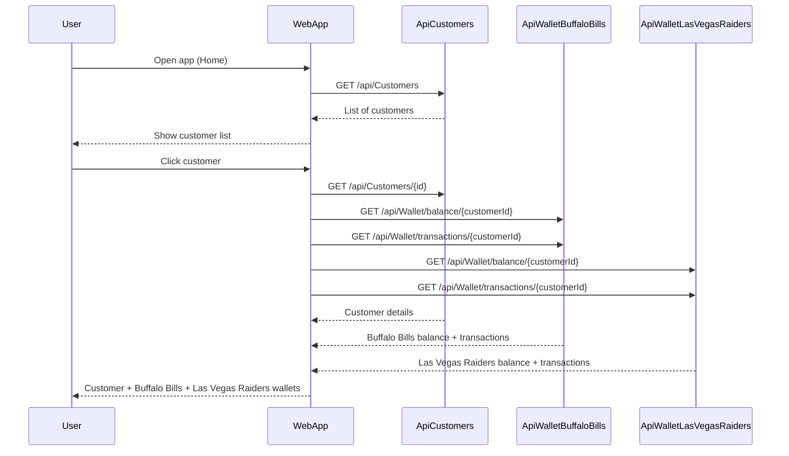
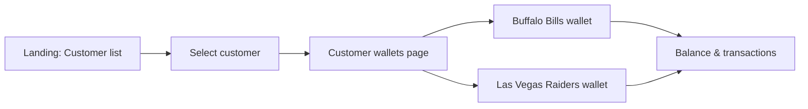

# NFL Stadium Wallet

Web app to view customer data and two virtual wallets (**Buffalo Bills** and **Las Vegas Raiders**) per customer for use at NFL stadiums. Built with a **Vue 3 + Vite** frontend and three **.NET 8.0** backend APIs, each with its own SQLite database. APIs expose **Swagger** and are configured for **CORS** from the frontend.

---

## Architecture Overview

| Layer        | Technology                    | Description |
|-------------|-------------------------------|-------------|
| **Frontend**| Vue 3, Vite, vue-router       | SPA served by Apache (UBI8 httpd-24); build with Node.js (UBI8 nodejs-20). |
| **APIs**    | .NET 8.0, ASP.NET Core        | Three services: ApiCustomers, ApiWalletBuffaloBills, ApiWalletLasVegasRaiders. Path base `/api`, Swagger at `/api/swagger`, CORS allowed for frontend origins. |
| **Data**    | SQLite                        | One database per API: `customers.db`, `buffalobills.db`, `lasvegasraiders.db`. |

**Containers (Podman/OpenShift):** Each service runs in its own container. Frontend image is multi-stage: Node.js build → Apache serve. APIs use UBI8 .NET 8.0 images.

---

## Architecture Diagram


Each API also serves **Swagger UI** at `/api/swagger` for interactive docs.

---

## Flow Diagram



**User flow (high level):**



---

## Prerequisites

- **.NET 8.0 SDK** — for building and running the three APIs locally
- **Node.js 20** — for the Vue frontend (e.g. `npm install` and `npm run dev`)
- **Podman** (and optionally **podman-compose**) — for containerized run
- **Red Hat OpenShift Dev Spaces** — optional, for the devfile-based workspace

---

## Running the Solution

### Local (APIs + Vue frontend)

From the repository root:

1. **Start the three APIs** (each in its own terminal):

   ```bash
   dotnet run --project ApiCustomers
   dotnet run --project ApiWalletBuffaloBills
   dotnet run --project ApiWalletLasVegasRaiders
   ```

   By default they listen on **5001**, **5002**, **5003** respectively.

2. **Start the Vue dev server:**

   ```bash
   cd frontend && npm install && npm run dev
   ```

3. Open **http://localhost:5173** (Vite).  
   The frontend uses `VITE_API_*` env vars (see `frontend/.env` or `vite.config.js`); defaults point to `localhost:5001`, `5002`, `5003` for the three APIs.

### Containers (Podman Compose)

From the repository root (same folder as `podman-compose.yml`):

```bash
podman-compose up -d --build
```

- **Frontend (Apache):** http://localhost:5160  
- **ApiCustomers:** http://localhost:5001/api  
- **ApiWalletBuffaloBills:** http://localhost:5002/api  
- **ApiWalletLasVegasRaiders:** http://localhost:5003/api  

Each API exposes **Swagger UI** at `/api/swagger` (e.g. http://localhost:5001/api/swagger, http://localhost:5002/api/swagger, http://localhost:5003/api/swagger).

SQLite data is persisted in named volumes. The frontend image is built with Node.js (UBI8) and served with Apache (UBI8 httpd-24); build args `VITE_API_*` set the API URLs for the browser.

### Red Hat OpenShift Dev Spaces

Use the included **devfile** (`devfile.yaml`). The workspace runs only the **frontend** (Vue 3 + Vite).

- **Build:** run the `build` command (installs npm dependencies in `frontend/`).
- **Run:** run the `run` command (starts the Vue dev server on port 5173).

**APIs:** Run the three .NET APIs outside the devfile (e.g. `dotnet run` in separate terminals or `podman-compose up` for the API services only). Set `VITE_API_*` in the devfile to match where the APIs are reachable (e.g. `http://localhost:8080/api`, `8081`, `8082`). CORS is configured to allow requests from `http://localhost:5160` and `http://localhost:5173`.

---

## Project Structure

```
├── ApiCustomers/              # Customers API — path /api, Swagger, CORS, SQLite (customers.db)
├── ApiWalletBuffaloBills/     # Buffalo Bills wallet API — path /api, Swagger, CORS, SQLite (buffalobills.db)
├── ApiWalletLasVegasRaiders/  # Las Vegas Raiders wallet API — path /api, Swagger, CORS, SQLite (lasvegasraiders.db)
├── frontend/                  # Vue 3 + Vite SPA (NFL Stadium Wallet UI)
│   ├── Containerfile          # Multi-stage: UBI8 Node.js 20 build → UBI8 httpd-24 serve
│   ├── httpd.conf             # Apache SPA routing (fallback to index.html)
│   └── src/
├── NFL-Wallet.sln             # .NET solution (three APIs)
├── podman-compose.yml         # Full stack: frontend + 3 APIs (Podman)
├── devfile.yaml               # Red Hat Dev Spaces — frontend only (Vue dev server)
└── README.md
```

- **APIs:** Containerfile based on Red Hat UBI8 .NET 8.0; Swagger (Swashbuckle), CORS, SQLite.
- **Frontend:** Containerfile build stage = UBI8 Node.js 20; runtime stage = UBI8 httpd-24 serving `dist/`.

---

## Configuration

- **Frontend API URLs** (build-time env or `podman-compose` build args):
  - `VITE_API_CUSTOMERS_URL` (e.g. `http://localhost:5001/api`)
  - `VITE_API_BILLS_URL` (e.g. `http://localhost:5002/api`)
  - `VITE_API_RAIDERS_URL` (e.g. `http://localhost:5003/api`)
- **CORS (APIs):** Allowed origins are `http://localhost:5160`, `http://localhost:5173`, and `http://127.0.0.1:5160`, `http://127.0.0.1:5173`. Change in each API’s `Program.cs` if the frontend runs elsewhere.
- **Databases:** Each API uses a **SQLite** file; connection string is configurable (e.g. `ConnectionStrings:DefaultConnection`). Seed data is applied on first run when the DB is empty.
- **Authentication:** The solution is prepared for **OpenID Connect / Keycloak**; add and configure the authentication middleware in each project as needed.

---

## License

See repository license file if present.
