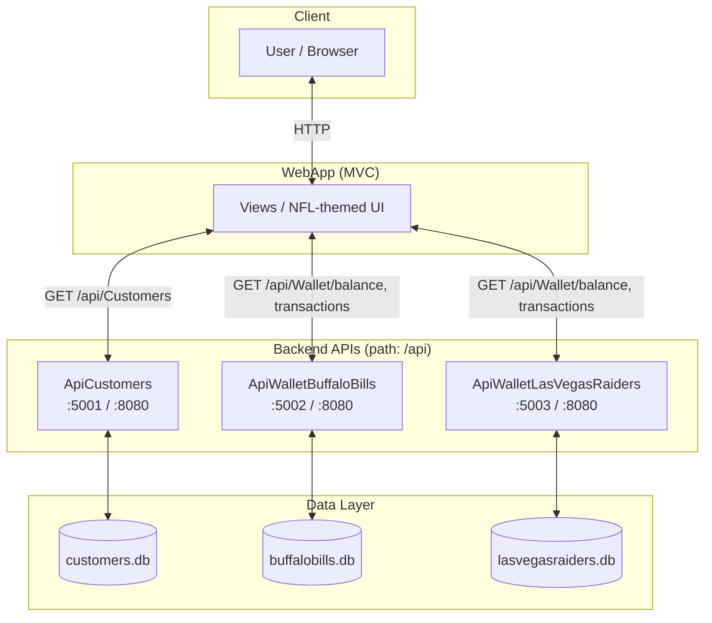
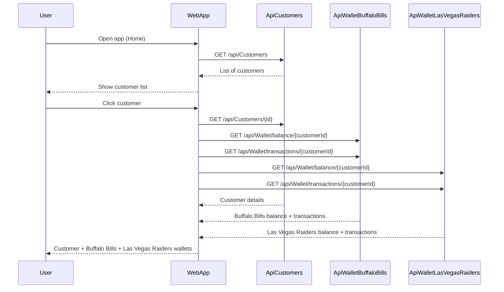
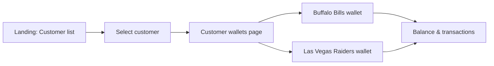

# NFL Wallet

.NET 8.0 solution that provides a web UI to view customer data and two virtual wallets (**Buffalo Bills** and **Las Vegas Raiders**) per customer. It consists of a frontend WebApp and three backend APIs, each with its own SQLite database.

---

## Architecture Diagram



**Containers (Podman/OpenShift):** Each service runs in its own container. The WebApp calls the three APIs by service name (`api-customers`, `api-buffalo-bills`, `api-las-vegas-raiders`) when using `podman-compose` or the devfile.

---

## Flow Diagram



**User flow (high level):**



---

## Prerequisites

- **.NET 8.0 SDK** — for local run and build
- **Podman** (and optionally **podman-compose**) — for containerized run
- **Red Hat OpenShift Dev Spaces** — optional, for the devfile-based workspace

---

## Running the Solution

### Local (all APIs + WebApp)

From the solution root (where `NFL-Wallet.sln` is):

1. **Start the three APIs** (each in its own terminal):

   ```bash
   dotnet run --project ApiCustomers
   dotnet run --project ApiWalletBuffaloBills
   dotnet run --project ApiWalletLasVegasRaiders
   ```

2. **Start the WebApp:**

   ```bash
   dotnet run --project WebApp
   ```

3. Open **http://localhost:5160**.  
   Default API base URLs in `WebApp/appsettings.json` are `localhost:5001`, `5002`, `5003` for the three APIs.

### Containers (Podman Compose)

From the repository root (same folder as `podman-compose.yml`):

```bash
podman-compose up -d --build
```

- **WebApp:** http://localhost:5160  
- **ApiCustomers:** http://localhost:5001/api  
- **ApiWalletBuffaloBills:** http://localhost:5002/api  
- **ApiWalletLasVegasRaiders:** http://localhost:5003/api  

SQLite data is persisted in named volumes.

### Red Hat OpenShift Dev Spaces

Use the included **devfile** (`devfile.yaml`):

- **Build all:** run the `build-all` command.
- **Run all services:** run the `run-all` command (starts all four components in parallel).

The devfile configures the WebApp to call the APIs using the Dev Spaces service names and port 8080.

---

## Project Structure

```
├── ApiCustomers/           # Customer API (path /api, SQLite: customers.db)
├── ApiWalletBuffaloBills/  # Buffalo Bills wallet API (path /api, SQLite: buffalobills.db)
├── ApiWalletLasVegasRaiders/ # Las Vegas Raiders wallet API (path /api, SQLite: lasvegasraiders.db)
├── WebApp/                 # MVC frontend (NFL-themed), consumes the three APIs
├── NFL-Wallet.sln
├── podman-compose.yml      # Run full stack with Podman
├── devfile.yaml            # Red Hat Dev Spaces (schema 2.2.2)
└── README.md
```

Each API and the WebApp have a **Containerfile** (Red Hat UBI8 .NET 8.0 image) and optional `.dockerignore`/`.containerignore` for builds.

---

## Configuration

- **WebApp API URLs** (e.g. in `appsettings.json` or environment):
  - `Api:CustomersBaseUrl`
  - `Api:BuffaloBillsBaseUrl`
  - `Api:LasVegasRaidersBaseUrl`
- **Databases:** Each API uses a **SQLite** file; connection string is configurable (e.g. `ConnectionStrings:DefaultConnection`). Seed data is applied on first run when the DB is empty.
- **Authentication:** The solution is prepared for **OpenID Connect / Keycloak**; add and configure the authentication middleware in each project as needed.

---

## License

See repository license file if present.
