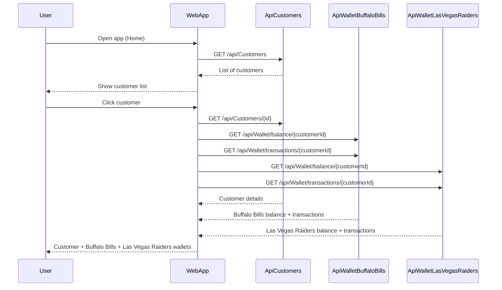
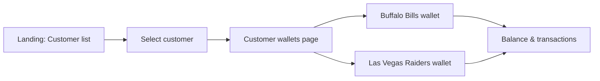

# NFL Stadium Wallet

[](https://github.com/maximilianopizarro/NFL-Wallet/actions/workflows/build-push-quay.yml)

Web app to view customer data and two virtual wallets (**Buffalo Bills** and **Las Vegas Raiders**) per customer for use at NFL stadiums. Built with a **Vue 3 + Vite** frontend and three **.NET 8.0** backend APIs, each with its own SQLite database. APIs expose **Swagger** and are configured for **CORS** from the frontend.

---

## Architecture Overview

| Layer        | Technology                    | Description |
|-------------|-------------------------------|-------------|
| **Frontend**| Vue 3, Vite, vue-router       | SPA served by Apache (UBI8 httpd-24); build with Node.js (UBI8 nodejs-20). |
| **APIs**    | .NET 8.0, ASP.NET Core        | Three services: ApiCustomers, ApiWalletBuffaloBills, ApiWalletLasVegasRaiders. Path base `/api`, Swagger at `/api/swagger`, CORS allowed for frontend origins. |
| **Data**    | SQLite                        | One database per API: `customers.db`, `buffalobills.db`, `lasvegasraiders.db`. |

**Containers (Podman/OpenShift):** Each service runs in its own container. Frontend image is multi-stage: Node.js build → Apache serve. APIs use UBI8 .NET 8.0 images.

---

## Architecture Diagram


Each API also serves **Swagger UI** at `/api/swagger` for interactive docs.

---

## Flow Diagram



**User flow (high level):**



---

## Prerequisites

- **.NET 8.0 SDK** — for building and running the three APIs locally
- **Node.js 20** — for the Vue frontend (e.g. `npm install` and `npm run dev`)
- **Podman** (and optionally **podman-compose**) — for containerized run
- **Red Hat OpenShift Dev Spaces** — optional, for the devfile-based workspace

---

## Running the Solution

### Local (APIs + Vue frontend)

From the repository root:

1. **Start the three APIs** (each in its own terminal):

   ```bash
   dotnet run --project ApiCustomers
   dotnet run --project ApiWalletBuffaloBills
   dotnet run --project ApiWalletLasVegasRaiders
   ```

   By default they listen on **5001**, **5002**, **5003** respectively.

2. **Start the Vue dev server:**

   ```bash
   cd frontend && npm install && npm run dev
   ```

3. Open **http://localhost:5173** (Vite).  
   The frontend uses `VITE_API_*` env vars (see `frontend/.env` or `vite.config.js`); defaults point to `localhost:5001`, `5002`, `5003` for the three APIs.

### Containers (Podman Compose)

From the repository root (same folder as `podman-compose.yml`):

```bash
podman-compose up -d --build
```

- **Frontend (Apache):** http://localhost:5160  
- **ApiCustomers:** http://localhost:5001/api  
- **ApiWalletBuffaloBills:** http://localhost:5002/api  
- **ApiWalletLasVegasRaiders:** http://localhost:5003/api  

Each API exposes **Swagger UI** at `/api/swagger` (e.g. http://localhost:5001/api/swagger, http://localhost:5002/api/swagger, http://localhost:5003/api/swagger).

SQLite data is persisted in named volumes. The frontend image is built with Node.js (UBI8) and served with Apache (UBI8 httpd-24); build args `VITE_API_*` set the API URLs for the browser.

### Red Hat OpenShift Dev Spaces

The **devfile** (`devfile.yaml`) defines two components:

| Component | Image | Purpose |
|-----------|--------|---------|
| **apis** | UBI8 .NET 8.0 | Git, oc (when in Dev Spaces), and the three .NET APIs. Build and run the backend here. |
| **webapp** | UBI8 Node.js 20 | Vue 3 + Vite frontend. Build and run the UI here. |

**Commands:**

- **build** (webapp): `npm install`, fix permissions on `node_modules/.bin`, and `npm run build`.
- **run** (webapp): start the Vite dev server with `npx vite` (port 5173).
- **build-apis** (apis): build the three .NET projects (ApiCustomers, ApiWalletBuffaloBills, ApiWalletLasVegasRaiders).
- **run-apis** (apis): start the three APIs in the background on ports 8080, 8081, 8082.

**Suggested order:** Run **build-apis** then **run-apis** in the `apis` container; run **build** then **run** in the `webapp` container.

**How the frontend reaches the APIs in Dev Spaces:** The browser cannot call `localhost:8080` (that would be the user’s machine). The webapp component sets **public API URLs** in env (`API_CUSTOMERS_URL`, `API_BILLS_URL`, `API_RAIDERS_URL`). When you run **run-frontend**, it writes `frontend/public/config.json` from those env vars so the browser calls the APIs directly (no proxy, no ENOTFOUND). If your cluster URLs differ, edit those env vars in the devfile and restart run-frontend. CORS on the apis component allows the webapp origin (`*`).

**If run-apis does not start the APIs:** The devfile uses **bash** and **disown** so the .NET processes keep running after the command exits. If they still do not start, run the same `dotnet run` commands manually in a terminal in the **apis** container (after build); start the three APIs on 8080, 8081, 8082.

### Build images and push to Quay.io

From the repository root:

```bash
./build-push-quay.sh [quay-namespace]
```

Default namespace: `maximilianopizarro`. Requires `podman` and being logged in to Quay (`podman login quay.io`). Images pushed:

- `nfl-wallet-api-customers`, `nfl-api-bills`, `nfl-wallet-api-raiders`, `nfl-wallet-webapp`

### Helm chart (Kubernetes / OpenShift)

The **`helm/nfl-wallet`** chart deploys the four components with this layout:

| Service        | Service port | Pod (container) port |
|----------------|--------------|------------------------|
| api-customers  | 8080         | 8080                  |
| api-bills      | 8081         | 8080                  |
| api-raiders    | 8082         | 8080                  |
| webapp         | 5173         | 8080                  |

```bash
helm install nfl-wallet ./helm/nfl-wallet -n nfl-wallet
```

See **`helm/nfl-wallet/README.md`** for values and setting API URLs for the browser (e.g. when using Ingress).

---

## Project Structure

```
├── ApiCustomers/              # Customers API — path /api, Swagger, CORS, SQLite (customers.db)
├── ApiWalletBuffaloBills/     # Buffalo Bills wallet API — path /api, Swagger, CORS, SQLite (buffalobills.db)
├── ApiWalletLasVegasRaiders/  # Las Vegas Raiders wallet API — path /api, Swagger, CORS, SQLite (lasvegasraiders.db)
├── frontend/                  # Vue 3 + Vite SPA (NFL Stadium Wallet UI)
│   ├── Containerfile          # Multi-stage: UBI8 Node.js 20 build → UBI8 httpd-24 serve
│   ├── httpd.conf             # Apache SPA routing (fallback to index.html)
│   └── src/
├── NFL-Wallet.sln             # .NET solution (three APIs)
├── podman-compose.yml         # Full stack: frontend + 3 APIs (Podman)
├── devfile.yaml               # Red Hat Dev Spaces — apis (UBI + .NET) + webapp (Node), build/run both
├── build-push-quay.sh         # Build all images and push to quay.io
├── helm/nfl-wallet/           # Helm chart — api-customers, api-bills, api-raiders, webapp
└── README.md
```

- **APIs:** Containerfile based on Red Hat UBI8 .NET 8.0; Swagger (Swashbuckle), CORS, SQLite.
- **Frontend:** Containerfile build stage = UBI8 Node.js 20; runtime stage = UBI8 httpd-24 serving `dist/`.

---

## Configuration

- **Frontend API URLs:** The app reads base URLs in this order: (1) runtime **`/config.json`** (same origin), (2) build-time `VITE_API_*` env. Each base URL must **end with `/api`** (e.g. `http://...api-customers.../api`), because the APIs serve at `/api/Customers` and `/api/Wallet/...` — not at `/api-customers` or `/api-bills` on the host. Use **`frontend/public/config.json`** with `apiCustomersUrl`, `apiBillsUrl`, `apiRaidersUrl` when the frontend is served from a different host (e.g. OpenShift).
- **CORS (APIs):** Configurable via **`Cors:AllowedOrigins`** in `appsettings.json` or env **`CORS__AllowedOrigins`** (comma-separated list). Use `*` to allow any origin (e.g. in the devfile the apis component sets `CORS__AllowedOrigins=*`).
- **Databases:** Each API uses a **SQLite** file; connection string is configurable (e.g. `ConnectionStrings:DefaultConnection`). Seed data is applied on first run when the DB is empty.
- **Authentication:** The solution is prepared for **OpenID Connect / Keycloak**; add and configure the authentication middleware in each project as needed.

### OpenShift / Dev Spaces (public routes)

When the frontend is at e.g. `http://kube-admin-nfl-wallet-webapp.apps.../` and the APIs at `http://kube-admin-nfl-wallet-api-customers.apps.../api`, etc.:

1. **Frontend:** Edit **`frontend/public/config.json`** and set the public API base URLs (with `/api` at the end), then rebuild/run the frontend so the browser gets that config:
   ```json
   {
     "apiCustomersUrl": "http://kube-admin-nfl-wallet-api-customers.apps.cluster-XXX.XXX.sandboxXXX.opentlc.com/api",
     "apiBillsUrl": "http://kube-admin-nfl-wallet-api-bills.apps.cluster-XXX.XXX.sandboxXXX.opentlc.com/api",
     "apiRaidersUrl": "http://kube-admin-nfl-wallet-api-raiders.apps.cluster-XXX.XXX.sandboxXXX.opentlc.com/api"
   }
   ```
2. **CORS:** In the devfile the **apis** component has `CORS__AllowedOrigins=*` so the webapp origin is allowed. For production you can set `CORS__AllowedOrigins` to the exact webapp URL(s).
3. **Swagger:** Each API serves Swagger UI at **`/api/swagger`** (e.g. `http://...-api-customers.../api/swagger`). If it does not load, check that the route for the API includes the `/api` prefix and that the pod is receiving the request.

---

## License

See repository license file if present.
